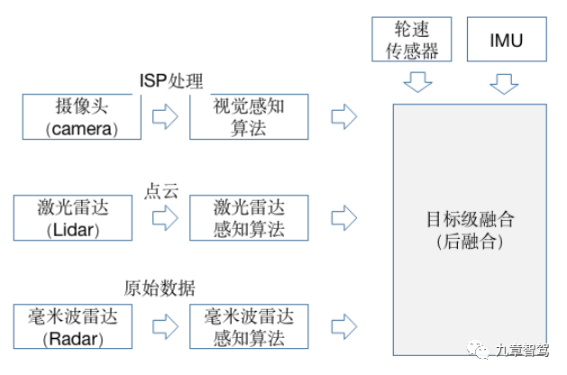
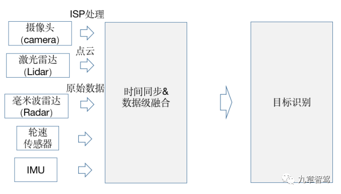
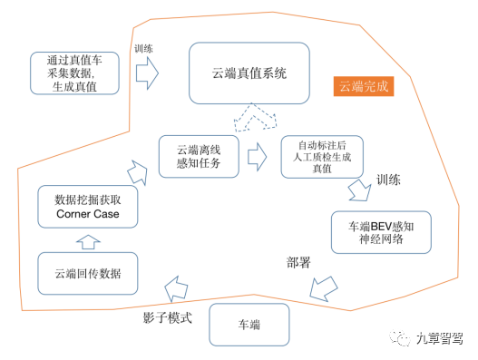
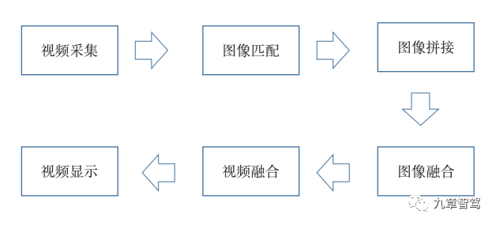

# 万字读懂BEV空间内的特征级融合

在高等级智能驾驶领域，除了特斯拉和mobileye走的是纯视觉技术路线外，其他大多数玩家走的还是多传感器融合的技术路线。

多传感器融合方案，一方面能够充分利用不同工作原理的传感器，提升对不同场景下的整体感知精度，另一方面，也可以在某种传感器出现失效时，其他传感器可以作为冗余备份。

目前多传感器融合方案，主要有后融合（目标级融合）、前融合（数据级融合）和中融合（特征级融合）三种。

## 多传感器融合方案

### 传感器后融合（目标级融合）

所谓后融合，是指各传感器针对目标物体单独进行深度学习模型推理，从而各自输出带有传感器自身属性的结果，并在决策层进行融合，这也是当前的主流方案。

其优势是不同的传感器都独立进行目标识别，解耦性好，且各传感器可以互为冗余备份。

对于Tier 1而言，后融合方案便于做标准的模块化开发，把接口封装好，提供给主机厂“即插即用”。

对于主机厂来说，后融合算法比较简单，每种传感器的识别结果输入到融合模块，融合模块对各传感器在不同场景下的识别结果，设置不同的置信度，最终根据融合策略进行决策。

不过后融合也有缺点，最大的问题就是，各自传感器经过目标识别再进行融合时，中间损失了很多有效信息，影响了感知精度，而且最终的融合算法，仍然是一种基于规则的方法，要根据先验知识来设定传感器的置信度，局限性很明显。

 

### 传感器前融合（数据级融合）

所谓前融合，是指把各传感器的数据采集后，经过数据同步后，对这些原始数据进行融合。

其优势是可以从整体上来处理信息，让数据更早做融合，从而让数据更有关联性，比如把激光雷达的点云数据和摄像头的像素级数据进行融合，数据的损失也比较少。

不过其挑战也很明显，因为视觉数据和激光雷达点云数据是异构数据，其坐标系不同，视觉数据是2D图像空间，而激光雷达点云是3D空间，在进行融合时，只能在图像空间里把点云放进去，给图像提供深度信息，或者在点云坐标系里，通过给点云染色或做特征渲染，而让点云具有更丰富的语义信息。

坐标系的不同，也导致前融合的效果并不理想，一方面，前融合需要处理的数据量较大，对算力要求较高；另一方面，前融合要想达到好的效果，对融合策略要求较高，过程非常复杂，所以目前业内应用并不多。  

为了解决异构传感器坐标系不一致的问题，开发人员常常会把视觉2D图像转到3D坐标系下，这样就和其他传感器数据，如激光雷达点云数据，所在的空间保持一致，从而可以在相同坐标系下进行融合。

将视觉信息转换到3D坐标系，就是今天介绍的重点——BEV。

BEV是鸟瞰图（Bird’s Eye View）的简称，也被称为上帝视角，是‍‍一种用于描述感知世界的视角或坐标系（3D），BEV也用于代指在计算机视觉领域内的一种‍‍端到端的、由神经网络将‍‍视觉信息，从图像空间转换到BEV空间的技术。

虽然理论上BEV可以应用在前、中、后融合过程中，不过因为前融合实现难度大，一般很少将BEV应用在前融合，偶尔也会用在后融合上，更多会应用在介于数据级融合和目标级融合之间的特征级融合，即中融合上。

### 传感器中融合（特征级融合）

所谓中融合，就是先将各个传感器通过神经网络模型提取中间层特征（即有效特征），再对多种传感器的有效主要特征进行融合，从而更有可能得到最佳推理。
对有效特征在BEV空间进行融合，一来数据损失少，二来算力消耗也较少（相对于前融合），所以一般在BEV空间进行中融合比较多。

为了简化描述，如无特殊说明，下文提及的BEV感知，均指“BEV空间内的中融合”（特征级融合）。

那么，视角转换到BEV空间，究竟有什么意义呢？

想象一下停车就好了。停车挺有难度的，尤其对于新手司机来说。驾驶员不仅要注意前方，还要兼顾左右两个后视镜和车内倒车镜，根据经验去预估自车相对于周边障碍物的位置和距离。

而有了车载360环视功能，驾驶员能从上帝视角一目了然地看到自车周边物体的位置和距离，停车也就变得简单了很多。

具体到智能驾驶系统，因为感知、预测、决策和规划等模块，都是在3D空间内进行的，而摄像头看到的图像信息，只是真实物理世界在透视视图（Perspective View）下的投影，从图像得到的信息，需要经过复杂的后处理才能使用，信息损失也很多。而将视觉信息转换到BEV空间，则可以很方便地连接感知与下游的‍‍规划控制模块。

此外，BEV空间内的感知任务，在精度上也有优势。做2D感知时，面对远处的物体，可能几个像素的误差便可能导致几十米的真实误差，而在BEV空间内训练模型时，对远处误差的损失（loss）更加明显，所以感知结果也会更准确一些。

综上，这也就是BEV如此重要的原因。

### BEV的发展历史

在了解BEV的技术细节之前，我们先来了解下BEV的发展历史。

传统方法的BEV空间转换方法，一般是先在图像空间对图像进行特征提取，生成分割结果，然后通过IPM（Inverse Perspective Mapping，逆透视变换）函数转换到BEV空间。

什么是IPM？

在前视摄像头拍摄的图像中，由于透视效应现象（想象从一个点去看世界，透视效应会呈现出近大远小的观察结果）的存在，本来平行的事物（比如车道线），在图像中却不平行。IPM就是利用相机成像过程中的坐标系转化关系，对其原理进行抽象和简化，得到真实世界坐标系和图像坐标系之间坐标的对应关系，并进行公式化描述，从而消除这种透视效应，所以叫做逆透视变换。

IPM是一种连接图像空间和BEV空间的简单直接的方法，只需要知道相机内外参数就可以。相机内参数，指的是与相机自身特性相关的参数，比如焦距、像素大小等，而相机外参数则是相机在真实世界坐标系中的参数，比如相机的安装位置、旋转方向等。

不过，IPM依赖一些预先的假设，比如地面平直性假设（地面要是平的），且相机和地面之间没有相对运动（车辆的俯仰角不变）。

很多时候这个假设太严苛了，很难满足，比如在颠簸道路上，或者在车辆加速或减速产生俯仰时，系统对目标物的感知结果波动非常大，会产生“忽近忽远”的跳变，平行的车道线，这时也会变成“内八”或者“外八”。

于是就有了改进方案，那就是将相机的实时位姿考虑进来，加上俯仰角的修正补偿后，再进行空间转换。改进后虽然效果有所改善，但是实时位姿也很难准确得到，所以效果并不理想。

这两年，深度学习也开始被应用于BEV空间转换，且逐渐成为主流方案。

相比于依赖人为规则，使用神经网络从2D空间进行BEV空间转换，能够取得更好的感知效果。

具体的流程是，先通过一个共享的主干网络（Backbone）来提取每个相机的特征（feature），然后再通过Transformer等将多摄像头数据，完成从图像空间到BEV空间的转换。在BEV空间内，由于坐标系相同，可以很方便地将图像数据和其他传感器数据（如Lidar、Radar等）进行融合，还可以进行时序融合形成4D空间，这也是当下BEV技术的大趋势。

### BEV空间内中融合的优势

相比于后融合和前融合，在BEV空间内进行中融合具有如下优势：

#### 跨摄像头融合和多模融合更易实现

传统跨摄像头融合或者多模融合时，因数据空间不同，需要用很多后处理规则去关联不同传感器的感知结果，操作非常复杂。在BEV空间内做融合后，再做目标检测，算法实现更加简单，BEV空间内视觉感知到的物体大小和朝向也都能直接得到表达。

#### 时序融合更易实现

在BEV空间时，可以很容易地融合时序信息，形成4D空间。

在4D空间内，感知网络可以更好地实现一些感知任务，如测速等，甚至可以直接输出运动预测（motion prediction）给到下游的决策和规控。

#### 可“脑补”出被遮挡区域的目标

因为视觉的透视效应，2D图像很容易有遮挡，因而，传统的2D感知任务只能感知看得见的目标，对于遮挡完全无能为力，而在BEV空间内，可以基于先验知识，对被遮挡的区域进行预测，从而“脑补”出被遮挡区域可能存在物体。虽然“脑补”出的物体，有一定“想象”的成分，但这对于下游的规控模块仍有很多好处。

#### 更方便端到端做优化

传统做感知任务时，依次做目标识别、追踪和运动预测，更像是个“串行系统”，上游的误差会传递到下游从而造成误差累积，而在BEV空间内，感知和运动预测在统一空间内完成，因而可以通过神经网络直接做端到端优化，“并行”出结果，这样既可以避免误差累积，也大大减少了人工逻辑的作用，让感知网络可以通过数据驱动的方式来自学习，从而更好地实现功能迭代。

随着特斯拉和毫末智行等纷纷使用BEV空间转换，近期BEV也引起了行业内的高度关注，不过当前BEV的应用实践并不太多，业内专家仍有很多疑问，BEV感知的模型架构是什么？如何在BEV空间内做目标检测和模型训练？BEV语义感知地图是否可以代替高精地图？当前BEV仍有什么挑战？BEV的技术壁垒是什么？为什么有的公司可以这么做，而有的公司则不行？

带着这些问题，九章智驾采访了毫末智行的技术总监潘兴、纽劢科技的视觉专家符张杰、鉴智机器人研究总监朱政以及一些其他行业专家。

### BEV感知需要什么样的架构

虽然每个公司使用的BEV感知架构可能不完全相同，但是大致架构类似。

第一步，先将摄像头数据输入到共享的骨干网络（Backbone），提取每个摄像头的数据特征（feature）。

第二步，把所有的摄像头数据（跨摄）进行融合，并转换到BEV空间。

第三步，在BEV空间内，进行跨模态融合，将像素级的视觉数据和激光雷达点云进行融合。

第四步，进行时序融合，形成4D时空维度的感知信息。

最后一步，就是多任务输出，可以是静态语义地图、动态检测和运动预测等，给到下游规控模块使用。

值得一提的是，Transformer在CV领域的应用自2020年底就开始获得关注，随着2021年特斯拉在AI Day上公开其在FSD中使用了Transformer算法后，国内多家公司也纷纷开始将Transformer应用在感知系统中，如毫末智行、地平线、纽劢等。
相比于传统神经网络（如CNN）的局部感受野，Transformer的注意力机制，能够带来更好的全局感受野，让其在进行跨摄像头、跨传感器以及时序融合时，可以更好地在空间时序维度上建模，从而可以提升感知准确率。

南京大学、上海人工智能实验室和香港大学提出的BEVFormer算法架构就使用了Transformer，并在nuScenes测试集上的NDS指标上取得了新的当前最优水平（SOTA）56.9%，提升了9个点。

BEVFormer经过骨干网络提取特征后，经过了6个编码层（encoder），每一个都采用了典型的transformer结构。

具体实现上，BEVFormer通过预先设置参数的网格划分（grid-shaped）的BEV 查询机制（BEV queries）来利用时空信息。为了聚合空间信息，BEVFormer设计了空间交叉注意力机制（spatial cross-attention，即BEV 查询机制从多相机特征中通过注意力机制提取所需的空间特征），让BEV查询机制能从其感兴趣的多相机视角中提取特征，为了聚合时序信息，BEVFormer提出了时序自注意力机制（temporal self-attention，即每一时刻生成的BEV特征都从上一时刻的BEV特征获取所需的时序信息）来融合历史信息。

BEVFormer在通过Transformer进行BEV空间转换时，是通过预先设置参数的网格划分（grid-shaped）的BEV 查询机制和空间交叉注意力机制。

预先设置了一个大小为H x W x C的空间，作为BEVFormer的查询空间，其中H和W是BEV平面的空间尺寸，C为与该平面垂直的高度坐标，其中网格间隔值s代表了该空间的颗粒度，自车坐标作为原点，BEV查询机制负责不断查询，找到这个空间内每个坐标点（x , y）的柱状3D参考点，最终完成全部BEV空间转换。  

BEVFusion在进行BEV转换时，虽没使用Transformer，不过也经历了编码（encoder）和解码（decoder）两个过程，在解码过程中，把图像信息转化成BEV的3D空间的特征点云，每个像素都有一个预估深度D，N个输入相机会生成大小为 N x H x W x D 的相机特征点云，其中(H,W) 是相机特征图的大小，D为深度信息。

而转换成的BEV空间的特征点云，以自车作为坐标系原点，沿x轴和y轴展开，以局部网格采样的方式，如网格间隔(grid)为r，一般通过池化（pooling）操作来聚合每个 r × r  BEV空间网格内的特征，并沿 z 轴（高度方向）展平特征，于是完成了从2D到BEV空间的转换。

此外，纽劢提出的对多相机配置的BEV语义分割任务的BEVSegFormer架构，也用到了Transformer，并在nuScenes验证集的语义分割任务上取得了当前最优水平（SOTA）。

几位行业内专家认为，由于Transfromer先天具有更好的全局感受野，因而可以好地提取全局特征，既可以用来作为骨干网络，也可以在BEV转换中使用。

BEV+Transformer联合使用，优势会更加明显，有可能会成为行业发展趋势。

## BEV感知任务实践

### 如何在BEV空间内做3D目标检测？

在自动驾驶感知中，目标检测是非常重要的任务。

所有下游跟踪、预测、规划、控制等任务都需要目标检测“打好基础”，而下游任务都是在3D空间内完成的。因此，强大的 3D 检测能力是自动驾驶安全的保证。

在实际应用中，纯视觉方案面临从 2D 推测 3D“少一个维度” 的挑战。一般传统方案做3D检测时（如FCOS3D），先做2D的目标检测，再通过以激光雷达测的真值训练的神经网络去对2D目标预测深度，以此来得到3D目标的检测。

在BEV空间内可以直接进行3D目标检测，省去预测深度的过程，实现起来更简单。如把2D检测算法DETR稍加改造用于做3D目标检测的DETER3D，算法复杂度大大降低，也在NuScenes数据集上取得了当前最优水平（SOTA）的检测效果。

DETR3D论文中的感知结果显示，由于在BEV空间里的跨摄像头的融合效果更好，DETR3D对于相机附近超大的、被截断目标物（如大货车）的检出率有了明显的提升（在关键检出指标NDS上，FCOS3D：0.317，DETR3D：0.356）。

此外，BEV空间内的目标检测更容易做到“不重不漏”。

鉴智机器人朱政介绍道：“目标检测最重要是做到‘不重不漏’。在2D图像空间内，由于透视效应，遮挡严重，很容易重合和漏检；在BEV空间内，做到不重合很容易，只需要按照物理世界的规则，把重合的感知目标去掉即可；要做到不漏检，如果单帧图像下被完全遮挡，那的确没办法——不过，加上时序信息，即使在某几帧下被遮挡，只要不是一直被遮挡住，就可以在BEV空间‘脑补’出来。就像人开车一样，前几秒看到旁边车道有辆车，‍‍中间有几秒被大车挡住了，但我们知道再过几秒它还会出现。”

### 传统2D感知任务和BEV空间如何结合？

笔者有个疑问：在BEV空间内检测有这么多好处，那是不是所有的感知任务都可以在BEV空间内完成，传统的那些2D检测和语义分割等感知任务还有“用武之地”吗？
目前看下来，2D感知任务并不会完全被“弃用”，还是会与BEV空间内的检测任务结合进行使用。

鉴智机器人科学家朱政认为，一般的检测任务，如动态车辆、行人和静态车道线等，当然更适合在BEV空间内做，但也有些是在BEV空间内做不了或者更合适在2D空间内做的感知任务，比如红绿灯检测。

纽劢也认为，传统的2D检测和图像分割任务，其实是可以作为辅助来提升BEV感知任务的性能，可以根据下游的不同需求，来做不同的安排。

那么，2D感知的结果怎么对应到 BEV空间呢？

对于这个问题，地平线架构师刘景初在线上分享中提到，其实关键是要找到2D检测结果在BEV空间的映射关系，且这些映射关系要在不同的场景下表现得足够鲁棒，这是比较难的，需要很多后处理规则。

### 如何处理“脑补”出来的预测结果？

在BEV空间做目标检测时，对于被遮挡区域，感知模型会根据先验知识，“脑补”出被遮挡部分的目标。这种“脑补”的功能，无疑是非常令人惊喜的，地平线的架构师刘景柱在一次线上分享中，认为这种想象力是“一种感知范式的转变”。

那么对于“脑补”出的感知结果，到底如何使用才能最大化发挥其作用呢？

业内专家普遍认为，对于神经网络所“想象”出来的感知结果，应该和实际看到的感知结果做好区分，比如可以让感知结果输出时带一个“置信度”的标签，告诉下游这个结果到底是实际看到，还是“脑补”出来的。

对于下游而言，对不同置信度的结果的“可信赖度”是不同的，使用的时候也会做好甄别，比如对低置信度的感知结果使用时会做一些限制。

刘景初在线上分享时提到，对于低置信度的感知结果，只能用一些比较粗糙的信息，比如车道线是不能用的，但是如果前面有个路口，能看到人行横道，那么大概率两边会有延伸出去的道路，这个感知结果就是可以用的。

毫末智行的潘兴也认为，复杂拓扑结构道路环境下，“脑补”出的车道线准确度很一般，“经常出错，比如会在小路口时“脑补”将车道线延长，或者将待转区的线“脑补”成了车道线”，对于这类识别结果，毫末的选择是不使用，甚至直接选择不输出这些“脑补”的车道线感知结果。

鉴智机器人的朱政认为，“脑补”出的结果，可以作为隐变量或者放在隐空间存储起来，交给模型自行判断使用，而不去加太多人为规则去约束。 

### 时序融合有什么用处？

在BEV空间内，进行时序融合后形成的4D空间，除了上述提到的可以实现对暂时被遮挡的物体有更好的跟踪效果外，还可以更方便地对运动物体进行测速和运动预测。

#### 测速

除了像毫米波雷达这种自带测速功能的传感器外，其他传感器基于某一时刻的信息去做测速是很困难的，而融入了时序信息后，视觉就可以实现稳定地测速。

在2D图像空间内，一般采用光流法（Optical Flow）进行测速。

光流法，是在视频流中，利用上一帧代表同一目标物的像素点到下一帧的移动量，从而计算出目标物的运动速度的方法。

根据进行光流估计时图像的选取点是稀疏还是稠密，可以将光流估计分为稀疏光流（Sparse Optical Flow）和稠密光流（Dense Optical Flow），如下左图的稀疏光流为选取了明显的特征点进行光流估计，右图为连续帧稠密光流示意图。

稠密光流描述图像中每个像素向下一帧运动的方向和速度，为了便于识别，用不同的颜色和亮度表示光流的大小和方向，如黄色代表向下运动，紫色代表向上运动，速度越快颜色越深。  

在BEV空间内，因为能够直接获取到目标物体每帧下的具体位置信息，再加上前后帧的时间戳信息，就可以很容易求出目标物体的速度，“可以把根据位置信息得到的速度，再融合毫米波雷达提供的速度，这样结果会更准确，”一位行业内专家介绍道。

毫末智行潘兴认为，也可以在模型训练时，把速度信息直接标注上去，让车端模型根据前后帧的信息自行推理出来，“有了4D信息后，速度的真值也比较容易获取，训练起来更容易一些”，潘兴说道。  

#### 运动预测
自动驾驶系统需要与道路上的交通参与者进行互动，并预测他们未来的行为，以便能正确做好自车的规划控制。

云端有了4D时空信息，就像掌握了预知未来的“超能力”一样，可以准确地知道接下来每个目标物的运动轨迹，而用这些信息去训练神经网络，可以让模型根据过往的历史信息去预测目标物接下来的运动轨迹。

传统算法会先做感知，再做运动预测，中间会人为增加很多规则来处理感知结果，这样一方面会增加很多人工逻辑，增加了后续调优的难度，另一方面处理时也损失了很多有效信息。而神经网络则直接从感知传递到运动预测，全部在BEV空间内完成，减少信息损失的同时，还可以端到端做优化，减少了人工逻辑，大大提升数据迭代的效率。

此前也已经有一些端到端感知联合预测的实践。

英国的自动驾驶创业公司Wayve和剑桥大学合作提出的FIERY网络，也是基于纯视觉的方法，通过端到端的方式，通过摄像头输入，直接在BEV空间预测每个目标的运动轨迹（motion trajectory），并给出了具体轨迹的概率。

在网格划分时，如何权衡大小、远近目标检测的矛盾？

本质上，从2D图像到BEV空间的转化就是寻找一种映射关系，将2D图像的每个像素投射到3D空间，使图像的稠密语义信息在BEV空间得以完整保留。

一般在BEV转化时，都会使用网格划分机制。

具体转换过程，上文已经详细描述了，虽然转换过程的原理不难，但转化过程（如池化时）却非常消耗算力，主要是因为相机的特征点云密度非常大，比如200万像素的相机，每帧会生成200万个点特征点云，比激光雷达的点云密度要大得多。

所以，为了提高转换效率和节省算力，一般会限制网格的数量，这就需要预先设置好网格参数，主要是网格间隔(grid）和x/y轴的范围(range)。

这就带来了一个挑战，那就是如何在网格间隔参数设置时兼顾近处和远处、大目标和小目标。

网格间隔参数设置得大，BEV空间内的特征颗粒度就大，虽然计算运行速度比较快，但细节不是很丰富，网格参数小的话，颗粒度小，虽然细节丰富，但计算量大。
因为车端算力的限制，要想感知距离足够远，网格就不能设置得特别小，而网格大的话，就可能损失很多细节，小目标就可能会遗漏，这就需要采取折中的方案，也需要对网络做一些精细化的设计，使用一些人工规则或者加一些训练技巧。

纽劢的符张杰介绍：“可以对远处目标或者小目标加以更大的损失权重，这样网络就会更加关注远处目标或小目标，也可以利用多尺度的特征来解决这个问题。”

在BEV空间的多头感知任务中，不同的任务对于网格采样颗粒度和范围的需求不同，可以根据具体的任务来设置网格和范围参数，这个思想在纽劢的BEVSegFormer和鉴智机器人和清华大学团队共同提出的BEVerse网络架构中都有体现。

在BEVerse中的多头任务模型中，在语义地图感知任务中，由于车道线一般比较细，需把采样网格设置和x/y轴范围设置得比较小（x轴范围为[-30m，30m]，y轴为[-15m，15m]，间隔为0.15m），而在3D目标检测任务中，网格和范围可以设置地稍大一些（x轴和y轴范围均为[-51.2m，51.2m]，间隔为0.8m）。

鉴智机器人的朱政则提到，可以根据不同场景的需求，对不同的范围（x/y轴）进行采样，他说道：“要考虑功能对于感知范围的需求，比如某些功能只在高速公路上开启，那么对远处的目标就更关注一些；如果只在城区开启时，因为车速低，关注的范围就不需要那么远，这样可以节省部分算力。”

## BEV空间内的模型训练和优化

既然在BEV空间内做目标检测有这么多好处，那么如何训练BEV空间内的模型呢？

### 如何在BEV空间训练算法模型？

车端BEV网络的训练方式，还是采用传统的有监督学习，不过区别在于，和传统2D感知任务在2D图像空间内完成标注不同，其所需要的真值需要在BEV空间内完成标注。

据业内专家反馈，BEV训练最大的挑战是在训练神经网络所需要的真值（Ground Truth）的生成上。

训练所需的真值数据，是从车端的影子模式下回传的视频流数据中，通过数据挖掘筛选出有价值的corner case数据。这部分数据再进入云端真值系统。

云端真值系统的作用，先是进行三维重建，转换到BEV空间，再做时序融合，形成4D空间数据，再进行自动标注。

最后经过人工质检（QA）后就形成了所需要的真值。

这样4D空间的真值数据就可以用来训练车端的BEV感知模型了，训练完成后再继续部署到车端，这样不断迭代来形成闭环。

值得一提的是，上述的链路，尤其是车端影子模式+云端真值系统相结合的方式进行模型迭代形成数据闭环，更像是个“理想链路”。受限于实现技术难度和合规性，目前真正能够实现完整闭环的玩家，可以说是少之又少。

当前更普遍的还是自建采集车队，用激光雷达+视觉的真值车去采集数据，做联合4D标注来进行模型训练和迭代，并部署到车端。

### 如何提升BEV感知精度？

对于感知任务而言，精度是下游非常关心的。

由于视觉先天在测距方面存在不足，在BEV空间内提升感知精度就成为了至关重要的，而这又和模型训练密不可分。

根据业内专家的实践经验，要想提高车端BEV感知模型的精度，一般从这三方面入手：

#### 优化云端三维重建和标注模型

有监督学习模式下，训练数据真值的精度决定了所训练模型的精度上限。对于BEV感知模型而言，云端真值生成系统就是“老师”，要想提升车端BEV感知模型这位“学生”的水平，提升负责三维重建和自动标注的云端真值系统这位“老师”的水平是很重要的。

云端“老师”的三维重建功能，也是要经过数据进行训练的，为了让训练“老师”的数据有足够高的精度，一般会使用带激光雷达的真值车采集得到用于训练数据的真值。地平线的做法是，为了获取更好的重建效果，会使用真值车从不同的行驶方向采集同一个地点的数据。

除了提升用于训练“老师”的数据精度外，业内公司在使用云端真值系统进行离线感知任务时，会不惜算力做一些感知融合处理，如融合其他传感器数据（激光雷达、毫米波雷达等）和时序信息，从而获得完整的BEV空间的4D重建场景，以此作为真值来训练车端的网络。

如果车端回传的数据中有激光点云，数据精度会更高，效果也更好，如果没有激光点云，‍‍也可以依赖视觉进行三维重建。据了解，基于视觉数据进行云端三维重建的数据精度，也是可以满足车端模型训练要求的。而且，由于当前激光雷达上车较少且位置差异较大，目前业内还是以视觉数据为主进行三维重建。

在BEV空间下标注时，为了提升标注效率和标注精度，也会先用云端真值系统自动标注做预处理，完成后再人工进行校验，使真值的精度达到近似人类驾驶员能达到的精度。

#### 增加训练数据量

影子模式下，车端会设置很多触发器（trigger）的策略，采集有价值的数据回传到云端。

在云端进行数据挖掘后，找到有价值的corner case，然后重新去做真值生成，并通过数据驱动对车端网络进行训练迭代。 

毫无疑问，训练数据所覆盖的场景越多，车端模型的泛化能力越强，感知精度也越高。相比于训练数据的数量，更重要的是数据的质量，也就是数据需要覆盖更多的极端场景,如不同的城市道路、不同的光照条件等。

除了车端影子模式获取数据和自建采集车队外，还有一种更高效地获取数据的方法，那就是去年特斯拉AI Day提出来的通过仿真获取数据。

#### 优化车端网络架构

除了上述两点外，设计车端模型架构也是非常重要的，架构的好坏也直接决定了网络的效率和功能水平。

不过受访的多位专家也提到，对于BEV感知而言，并不需要一味地提升感知精度，最主要的评价指标还是看能否满足下游的需求。

其实感知精度的要求可以不用那么高，就像人开车一样，对于近处的物体精度高一点就可以，对于远处的物体来说，过于追求精度反而是没有必要的。

一位专注于做视觉的从业者说：“BEV空间内的视觉算法精度在相当一段范围内精度还是非常准的，‍‍基本可以控制在百分之几的误差。‍‍人开车的时候也是如此，前面200米左右有个东西，‍‍它的精确距离是200米还是220米，其实区别并不大。” 

### BEV语义地图有啥用？

在当前高等级智能驾驶系统中，高精地图所提供的语义信息，包括道路拓扑结构、车道线、限速要求等，能够让智能驾驶系统更好地理解现实世界的行车规则，也让很多人认为高精地图是通往高等级智能驾驶的道路上不可或缺的一部分。

不过当前大部分的高精地图，都是使用采集车得到的以点云为主的数据进行标注得来，地图的构建和维护成本都很高。

而HDMapNet、BEVSegFormer、BEVerse等方法，可以基于多摄像头信息，将BEV空间内的车道线、路沿、斑马线等静态目标物，在线生成局部语义地图供下游规控任务使用，大大降低了语义地图的构建和维护成本，从而可能会给行业带来地图构建和更新的新范式。

当前高速NOA的主流方案，还是依赖高精地图，不过当功能拓展到城区NOA时，目前城市道路尚无高精地图覆盖。

诸多业内专家认为BEV在线构建的语义地图可以一定程度上代替高精地图的作用，在城市NOA中发挥重要作用。

追势科技发布的城市记忆领航功能，也是利用了“单车多次”的记忆模式，利用车端传感器（激光雷达非必要）来实现特定通勤路线的语义地图的构建和更新，从而可以实现上下班这种特定路线的点对点领航辅助功能。

虽然在理论上，方案可行性没有大问题，不过在实际落地中也有不少挑战。

最大的挑战是精度，相比于高精地图，BEV语义地图的精度是略有不足的，而传统智能驾驶算法架构中，下游的规控任务都依赖高精地图提供精确的drive line，当面对上游给个“不那么精确”或者“大方向上正确”的语义地图时，要保证通过率，下游的规控逻辑也需要相应地调整。

不过，并不是说地图就完全不需要了，地图毕竟是超视距传感器，对于提前预知下个路口的道路拓扑结构还是很有帮助的。追势科技的城市记忆领航辅助中，也只有当特定路线的语义地图成熟、完整时，才可以启用记忆领航功能。

只是可能以后地图的精度不需要像现在的高精地图一样那么高了，有专家表示“可能未来导航地图上加一些语义信息就可以满足要求了”

### BEV模型和数据的通用性

不同的量产车型中，摄像头的数量、安装位置和具体参数存在较大的差异，使用传统后融合策略时，这些定制化的传感器适配带来了巨大的工作量。

那么，在BEV空间进行中融合时，是否会有差异呢？

一方面，在适配不同车型时，是否和传统的后融合有差异呢？

另一方面，从不同量产车型回传回来的数据，是否能够用于持续迭代统一的BEV感知模型呢？

### 如何适配不同车型

‍‍由于传统后融合太依赖人工后处理规则，在传感器适配时，有诸多的无比痛苦的定制化工作，可能安装位置或者视角稍微调整一下，就需要花大量的时间适配。
与后融合方案相比，BEV感知模型由于少了很多人工规则，通用能力要出色得多，虽然也需要做一些适配，但是整体工作量还是要少地多。

“换一个新车型，相机安装位置变了，这时候需要把相机重新标定一下，再采集数据训练一下，”一位行业专家说道。

为了提升BEV模型的泛化能力，一般可以通过预先设置‍‍结构化参数来适配不同车型（比如安装高度、安装位置、角度等），这样就可以在模型训练时排除相机内外参的影响。

不过也有一些模型，如BEVerse等，尝试把相机的内外参作为信号输入，直接给到模型进行训练，让神经网络自己去学着利用这些信息做适配，这样适配会更加方便，不过这也对BEV网络架构的设计提出了更高的要求。

### 回传数据的通用性

业内专家普遍认为，不同车型上的摄像头虽然可能位置、数量不同，但回传回来的数据（如图像、视频流）转换到BEV空间后，都可以很方便地用于训练BEV模型。
只是考虑到位置差异，在使用车端摄像头数据时，需要对多摄像头的重合部分做一下处理。

其实环视摄像头的视野重合部分并不多，前向多个不同FOV的摄像头会有较多重合部分。

要处理这种重合部分，可以采用拼接技术。每一张图像都有自己的特征点，数据采集后，先根据图像的特征点，对特征点相似的图像进行特征匹配（图像匹配），从而找到邻接图并将相邻的图像拼接在一起（图像拼接），然后就对特征相同的不同分辨率的图像进行融合（图像融合）。完成图像融合后，只需要把相邻帧图进行拼接成视频（视频融合），整个过程就完成了。

图像匹配过程中很关键的环节是图像特征点的获取和匹配。这可以通过SIFT、SURF等方法来实现，不过为了提升计算效率，业内一般通过降采样（类似于降低分辨率）的方式来进行特征检测。

在图像融合时，一般可用泊松算法、直接平均算法和加权算法等方法，直接平均算法业内用得更多一些。

除了上述的图像拼接外，为了消除不同车型的差异，业内还用到一种叫“虚拟相机”的方法来共享训练数据，“就是将图像投影到一个标准的视角上（训练时用的视角），投影后的相机就叫虚拟相机，这样就能保证回传数据和训练数据的视角相同了，”一位行业专家介绍道。

除了上述提到的视角问题外，一位行业专家也提到ISP（ Image Signal Process, 图像信号处理）的处理也可能会影响数据的通用性。不同摄像头的ISP不同，对Raw data的处理方式也不同，虽然可以通过技术手段来解决（如通过图像预处理统一到同一个色彩空间下），但也可能会影响到感知结果，“就像人带着墨镜看世界一样，看一般物体可能不受影响，看红绿灯就可能会受到一些影响”，这位专家解释道。

## BEV技术的局限性与挑战

### BEV解决不了视觉的“先天缺陷”

‍‍在传统的2D检测时，检测、分类和跟踪任务，都是依赖有监督学习的训练，也就是说感知网络只能识别出之前“见过”的物体，对于之前没“见过”的物体（即训练数据集里没有的），是识别不出来的，从而会出现“不认识就看不见”的现象，这也被认为是视觉的“先天缺陷”。比如少见的异形物体，如披萨盒，高速上奔跑的野生动物等，这种情况可能出现的概率并不高，但是一旦出现可能是致命的。

那么这个问题，在转换到BEV空间后，可以解决吗？

业内专家给的答案很一致：不能。

BEV模型没有训练过的物体，在BEV空间内，可能是“不存在”的。

不过仍然有其他办法来弥补这个缺陷，具体如下：

#### 深度（Depth）估计

当前在2D感知方案中应用比较广泛的是底层视觉感知（low level vision）中的深度估计。

深度估计一般是通过激光雷达的稀疏点云提供的真值进行训练，从而利用深度学习直接预测出稠密的深度值。通过预测深度就可以一定程度上解决异形物体问题。

如下图所示的右侧的拉了树木的大车，如果使用普通的车辆检测，因为这种训练样本极少，可能会漏检，而采用深度估计，至少可以知道该处有物体，可以及时采取措施，避免安全事故。

在BEV空间中，可以把底层视觉静态感知到的深度预估，转化为路面上的高度信息。下图所示为一帧所感知到的结果，蓝色表示路面，高度比较低，红色表示凸起，红色越深表示高度越高，也能看到一些地面上的凸起物体，可以根据识别出来的物体类别进行后续的决策规划，如果是无法识别的异形物体，那么最安全的方式就是避开它。

鉴智机器人推出的视觉雷达也是采用类似的原理，通过前向双目相机和环视相机产生深度信息生成稠密点云，并在BEV空间内进行目标检测。

#### 数据驱动

当然，底层视觉感知的深度估计也不是万能的，如果遇到一个没训练过的数据，可能在特征提取时就忽略了，所以，要解决这个问题的另一种方法就是数据驱动。

数据驱动依赖数据闭环工具链，各家也都开发了工具链系统，比如毫末智行的LUCAS、地平线的AIDI等。

#### 多传感器冗余

在纯视觉不能保证百分之百安全的情况下，采用多传感器冗余的方案成为了众多主机厂的选择，尤其是激光雷达，是对视觉非常好的补充。车端装了激光雷达之后，由于有更高精度的数据，能给视觉提供更好的真值数据，也能更好地训练视觉算法。

就像均胜电子郭继舜在一次线上分享时提到的，在不能保证完全安全的情况下，系统设计时考虑传感器冗余、硬件堆料等是非常必要的，也是“系统设计的正义”。

### BEV感知的挑战

总体而言，BEV是个全新的感知范式，向上下游（如定位和预测）都有很大的拓展空间，业内很多企业也都在积极探索实践中，但在实践中还有很多的挑战需要克服。

#### 数据问题

上文也提到了，BEV感知中最具备挑战的还是如何获取更多维度的数据，以及产生更高质量的真值。加上Transformer本身的特性，为更好地发挥优势，其对数据量的要求也比传统卷积神经网络大得多，这就越发加剧了模型对数据的“饥渴”程度。
要应对这个挑战，一方面依赖车端影子模式持续不断地采集数据，另一方面也依赖云端系统去做数据挖掘和真值生成，这需要持续不断地去优化云端真值系统的算法。

此外，为了减少标注工作量，提升训练效率，自监督学习也开始被引入到云端系统中。

和有监督学习不同，自监督学习的真值信息不是人工标注的，而是算法自动构造监督信息（真值），来进行监督学习或训练。当前自监督学习已经被应用在数据挖掘、数据标注和神经网络的预训练中。

#### 算力消耗问题

上文也提到过，由于使用Transfomer进行BEV空间转化非常消耗算力，对车端有限算力提出了挑战。

目前主要有两个优化的方向：

##### 模型轻量化

图像处理中，使用Transformer的计算复杂度与图像尺寸的平方成正比，这会导致，在图像很大的时候，计算量过于庞大。

如何在尽量不影响感知精度的前提下，降低Transformer的计算复杂度，节省车端算力，成了学术界和工业界普遍关注的问题。

为了解决这个问题，可以借鉴使用传统CNN中的模型压缩技巧来降低计算复杂度，比如：

* 剪枝：深度学习模型可以看作是一个复杂树状结构，如果能减去一些对结果没什么影响的旁枝，就可以实现模型的减小。
* 量化：深度学习模型由大量的浮点型（float）权重参数组成，如果能用低精度类型（如int 8）替代原有的高精度类型（如float 32）的权重参数，那么模型体积就会大大压缩，低位的浮点计算速度会远远高于高位浮点计算速度，这也是最容易实现的压缩方式。

此外，学术界也有一些最新的成果，可以供业界参考。

使用移动窗口操作（Shifted window scheme）、具有层级设计的（hierarchical architecture）的SwinTransformer，可以把计算复杂度大幅度降低到具有输入图像大小线性计算的复杂度，且在各种图像任务上也都有很好的性能，因而SwinTransformer可以被当做骨干网络来使用。

借鉴了DCN（Deformable Convolutional Networks，可变形卷积网络）的思想，Deformable DETR将DETR中的注意力机制替换成可变形注意力机制（与全局(global)&密集(dense)的注意力机制不同，可变形注意力机制能够聚焦于特征相关区域并捕获信息，从而实现局部(local)&稀疏(sparse)的高效注意力机制），使DETR范式的检测器更加高效，收敛速度也大大加快，并且给了业界启发，可以将可变形注意力泛化，形成了Deformable Transformer。

##### 多任务模型

除了上述模型压缩技巧外，还有一个常用的技巧，就是共享权重，有点像提取公因数，假设模型的每一层都有公用的公因数，是否可以提取出来做一次运算，而不是每一层都算一次，如共享骨干网络等，这就是应用普遍的多任务模型（Multi-Task learning）。

其中最出名的多任务模型，莫过于特斯拉的HydraNet，在一个模型中同时实现了目标检测、红绿灯检测和车道线检测三个任务。

使用多任务模型最明显的优势，就是因为共享特征提取的网络参数，避免了大量的重复计算，效率大大提升。

除此外，多任务模型还有个额外好处，就是有时可以加速网络的训练过程。因为共享网络的感知任务是强相关的，比如车道线检测和动态目标检测，在训练其中一个任务时，共享网络的特征提取能力也加强了，对于另外的任务的性能提升也是有帮助的。

那有没有可能在训练多任务模型的时候出现不同的任务“相互伤害”“此消彼长”的现象呢？

据地平线苏治中的线上分享中提到的，这种情况是有可能的，不过也有技巧办法可以解决。比如某个任务对其他任务伤害很大，就可以降低这个任务的学习速率（learning rate），降低它的权重，如果实在无法兼容，还可以单独再新建一个模型去训练这个任务。

比如BEVerse，就是在BEV空间内完成的多任务模型感知任务，完成了3D目标检测、局部语义地图和运动预测这三个任务，且每个模块都达到了当前最优水平（ SOTA）。

#### BEV算法更复杂、门槛更高

相比于传统2D图像检测，BEV感知算法会复杂得多，尤其是前文提到的云端的3D重建、4D空间的标注、真值生成和模型训练，都是之前2D感知任务中所没有的，相应地难度和门槛自然也要高一些。

不过，朱政也提到，由于BEV感知进入大家的视野还不太算太久，各家还在摸索中，有些算法还没那么成熟，等到后续量产实践多起来了，开源的工具也慢慢多起来了，门槛也会慢慢降低，“就像四五年前其实2D感知也没那么好做，不过现在成熟多了，有很多开源的算法，工具链也很成熟了，门槛就显得没那么高了，”朱政说道。

随着如BEV和Transformer等诸多视觉算法的进展，视觉能力的上限也大大提升。
诸多业内专家也提到，即使量产车辆装了激光雷达，在云端进行数据处理时，还是会以视觉为主，“毕竟，相比激光雷达先天的缺点（如点云稀疏、缺少语义信息等），视觉的优势非常明显，加上摄像头出货量更大，产业链更加成熟，后续升级也更加方便，比如可以很容易从800万像素升级到1600万像素，甚至现在手机摄像头的像素已经过亿了”，一位专家告诉九章智驾。

之前九章智驾采访一家进军L2前装量产市场的L4公司的CTO时，对方也提到，过去L4以激光雷达点云为主、视觉为辅的方案是有其历史原因的，因为那时基于深度学习的视觉算法还不成熟，能支持深度学习的大算力平台也不成熟，不过目前，视觉在L4方案中占的分量会越来越重，甚至未来有可能超过激光雷达。

随着图像转化到BEV空间后，也可以直接借鉴激光雷达、毫米波雷达领域的研究方法和进展。如果未来进一步绕过ISP，直接将RAW DATA输入到感知模型中，可进一步提升视觉在极限条件下（极暗和极亮）的感知能力，可以想象，未来视觉能力会有更大的发展，让我们拭目以待。

[原文-->](https://mp.weixin.qq.com/s/nCDH2aOwty0vme_IGZ2E0g)